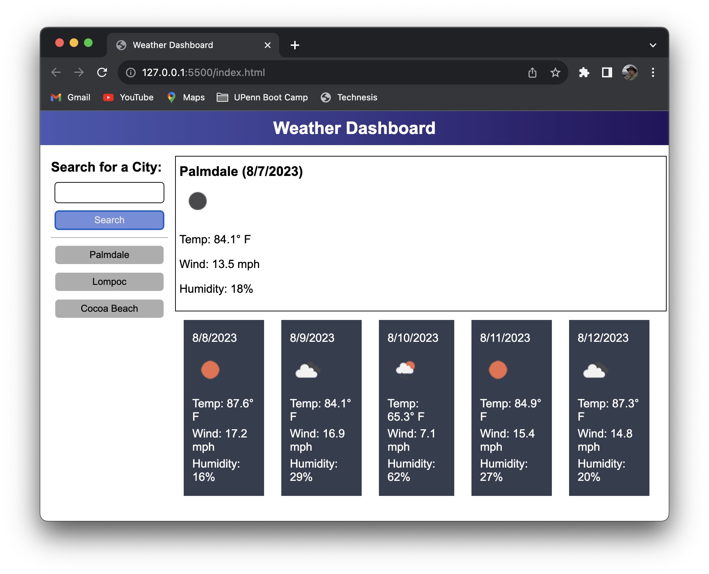

# Weather Dashboard

## Description

A project whose goal is to create a javascript-driven calendar / task tracker for a
single work day.

- Key features of the resulting HTML/CSS/Javascript site are:
    - Use of two APIs made available by [openweathermap.org](https://openweathermap.org/),
        specifically those referenced under [openweathermap.org/forecast5](https://openweathermap.org/forecast5).
    - Two-phase API look-up of weather information for a specified city:
        - First an API look-up of the city's coordinates via a Geocoding API
        - Second a weather API look-up using coordinates from the first API
    - Display of the current day's weather for the specified city, including:
        - City and Date
        - An icon/image representation of weather conditions
        - Temperature
        - Wind speed
        - Relative humidity
    - Display of daily forecast for up to five subsequent days for the same city:
        - Date
        - An icon/image representation of weather conditions
        - Temperature
        - Wind speed
        - Relative humidity
    - Conversion from scientific metric units (Kelvin and m/s) to standard U.S. common
        units of measure (Fahrenheit, mph)
    - A cumulative column of buttons for city's previous queried by this page/app
        - These buttons and associated data are persisted via localStorage
        - This storage includes includes latitude and longitude so that weather look-ups
            using these buttons do not require another use of the Geocoder API, only the
            weather API.
    - Responsiveness to screen width for purposes of displaying on smaller and mobile devices

- In completing this project, the following have been learned:
    - use of API interfaces via javascript fetch() function
    - use of asynchronous techniques in javascript, specifically Promises
    - URL parameter formatting
    - date/time manipulation using DayJS
    - formatting of numeric content for a fixed number of post-decimal digits

## Table of Contents

- [Usage](#usage)
- [Credits](#credits)
- [License](#license)

## Installation

For users of the this page, there is no installation needed beyond having a browser.  (see [Usage](#usage))

For developers, installation requires:
- Access to GitHub repository [github.com/stevreut/weather-dashboard](https://github.com/stevreut/weather-dashboard) 
- Appropriate tools for editing, testing, and deploying component modules.

## Usage

The result of this project is a web site accessible via web browser at [stevreut.github.io/weather-dashboard/](https://stevreut.github.io/weather-dashboard/) .  No installation is required beyond that for use.

Resulting web presentation should resemble the following:

## Credits

Special thanks to the teaching staff of the University of Pennsylvania Full Stack Coding Boot Camp (UPENN-VIRT-FSF-FT-07-2023-U-LOLC-M-F).

Innumerable publicly available reference resources were consulted in pursuing this project.  Specifically, among them
were:
- OpenWeatherMap API documentation [openweathermap.org/forecast5](https://openweathermap.org/forecast5)
- [MDN Web Docs](https://developer.mozilla.org/en-US/)
- [JavaScript Promises -- Tutorial for Beginners](https://www.youtube.com/watch?v=TnhCX0KkPqs) on YouTube channel [ColorCode](https://www.youtube.com/@ColorCodeio)

## License

As of this date (7 August 2023), no licensing policy has been established for this project or its repository.
